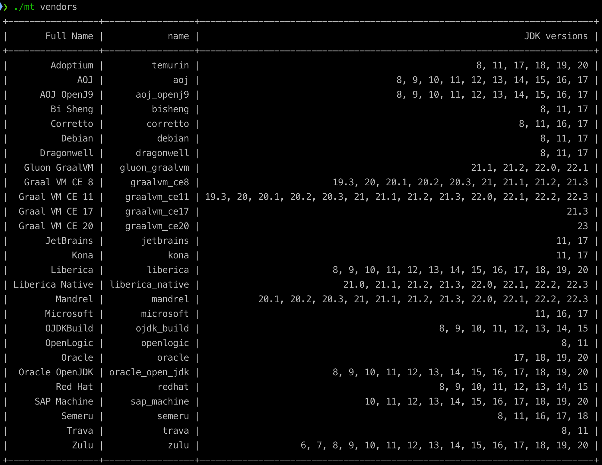

<!--
    Licensed to the Apache Software Foundation (ASF) under one
    or more contributor license agreements.  See the NOTICE file
    distributed with this work for additional information
    regarding copyright ownership.  The ASF licenses this file
    to you under the Apache License, Version 2.0 (the
    "License"); you may not use this file except in compliance
    with the License.  You may obtain a copy of the License at
      http://www.apache.org/licenses/LICENSE-2.0
    Unless required by applicable law or agreed to in writing,
    software distributed under the License is distributed on an
    "AS IS" BASIS, WITHOUT WARRANTIES OR CONDITIONS OF ANY
    KIND, either express or implied.  See the License for the
    specific language governing permissions and limitations
    under the License.
-->
Toolchains Maven Plugin
=========================

Extend maven-toolchains-plugin to add JDK auto download and toolchains.xml management.

# Features

* JDK auto download by Foojay API support, and install directory is `~/.m2/jdks`
* Add new toolchain into toolchains.xml dynamically
* SDKMAN integration: add JDK to toolchains.xml from [SDKMAN](https://sdkman.io/) if SDKMAN detected
* JBang integration: add/auto-install JDK to toolchains.xml from [JBang](https://www.jbang.dev/) if jbang detected

# Requirements

* Maven 3.5+
* JDK 1.7+

# How to use?

Add following plugin configuration to your pom.xml:

```xml

<build>
    <plugins>
        <plugin>
            <groupId>org.mvnsearch</groupId>
            <artifactId>toolchains-maven-plugin</artifactId>
            <version>4.5.0</version>
            <executions>
                <execution>
                    <goals>
                        <goal>toolchain</goal>
                    </goals>
                </execution>
            </executions>
            <configuration>
                <toolchains>
                    <jdk>
                        <version>17</version>
                    </jdk>
                </toolchains>
            </configuration>
        </plugin>
    </plugins>
</build>
```

And you can try it quickly:

```
$ git clone https://github.com/linux-china/java17-demo.git
$ cd java17-demo
$ mvn compile
```

# GraalVM support

* vendor should be `graalvm_ce17` or `graalvm_ce11`
* version is GraalVM version(not Java version), such as `22.3` or `22.3.0`
* GraalVM native-image component will be installed automatically

```xml

<plugin>
    <groupId>org.mvnsearch</groupId>
    <artifactId>toolchains-maven-plugin</artifactId>
    <version>4.5.0</version>
    <executions>
        <execution>
            <goals>
                <goal>toolchain</goal>
            </goals>
        </execution>
    </executions>
    <configuration>
        <toolchains>
            <jdk>
                <version>22.3</version>
                <vendor>graalvm_ce17</vendor>
            </jdk>
        </toolchains>
    </configuration>
</plugin>
```

# How to get a list of all supported distributions and JDK versions?

Please visit https://api.foojay.io/disco/v3.0/distributions to get all information.

* jdk vendor is the value of `api_parameter`
* jdk version value could be any value in `versions` array

Or you can use [Maven toolchains CLI](https://github.com/linux-china/maven-toolchains-cli) to get all supported JDKs information.



# How to skip toolchains maven plugin on CI/CD platform?

```
$ mvn -Dtoolchain.skip -DskipTests package
```

# Different JDK for main/test code

Maven has support for using different source and target java versions for your project's main code and tests.
You can add `testJdk` toolchain in `toolchains-maven-plugin` to specify the JDK for test code as below:

```xml

<plugins>
    <plugin>
        <groupId>org.apache.maven.plugins</groupId>
        <artifactId>maven-compiler-plugin</artifactId>
        <version>3.11.0</version>
        <executions>
            <execution>
                <id>default-testCompile</id>
                <phase>test-compile</phase>
                <goals>
                    <goal>testCompile</goal>
                </goals>
                <configuration>
                    <jdkToolchain>
                        <version>18</version>
                    </jdkToolchain>
                </configuration>
            </execution>
        </executions>
        <configuration>
            <source>8</source>
            <target>8</target>
            <parameters>true</parameters>
            <testSource>18</testSource>
            <testTarget>18</testTarget>
            <testRelease>18</testRelease>
            <testCompilerArgument>--enable-preview</testCompilerArgument>
        </configuration>
    </plugin>

    <plugin>
        <groupId>org.mvnsearch</groupId>
        <artifactId>toolchains-maven-plugin</artifactId>
        <version>4.5.0</version>
        <executions>
            <execution>
                <goals>
                    <goal>toolchain</goal>
                </goals>
            </execution>
        </executions>
        <configuration>
            <toolchains>
                <jdk>
                    <version>8</version>
                </jdk>
                <testJdk>
                    <version>18</version>
                </testJdk>
            </toolchains>
        </configuration>
    </plugin>
</plugins>
```

# References

* Apache Maven Toolchains Plugin: https://maven.apache.org/plugins/maven-toolchains-plugin/
* Maven toolchains CLI: https://github.com/linux-china/maven-toolchains-cli
* Disco CLI: a command line interface for the foojay.io Disco API - https://github.com/HanSolo/discocli
* foojay DiscoAPI: https://api.foojay.io/swagger-ui/
* Gradle Toolchains for JVM：https://docs.gradle.org/current/userguide/toolchains.html


sdkman support: sdk install java 17.0.7-graalce
